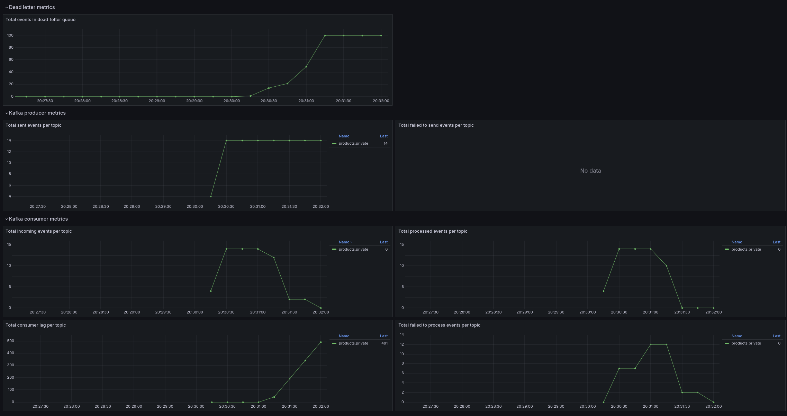

# 🧪 Stress Tests for Fault-Tolerant Message Processing Pattern

This project contains a set of **load and stress testing scenarios** built using `Scala` and `Gatling`. It is designed to simulate multi-user interactions for validating a custom architectural pattern for fault-tolerant message processing with message brokers.

🔗 **Related Repository:**  
[AndreyAgeev111/master-work](https://github.com/AndreyAgeev111/master-work)

---

## 🎯 Test Scenarios

The primary scenario simulates a typical user flow:

1. A user **creates a product**
2. Immediately **reserves the product**

This is achieved by calling the following HTTP endpoints:

- `POST /api/v1/products`  
- `POST /api/v1/products/{id}/reserve`

These actions are performed by virtual users with parameters defined in `simulation.conf`.

---

## 📊 Example Results

Based on the configuration used in `simulation.conf`, the following results were captured in `Grafana`:



The system successfully processed valid messages, and errors were redirected to the retry queue. However, once the queue exceeded its preconfigured threshold, the system switched to fallback mode. New erroneous messages were repeatedly retried but **not added to the queue**, maintaining system stability without further overloading.

---

## 🚀 Running the Tests

To execute the stress tests, run the following commands from the project root:

```bash
sbt "Gatling / testOnly com.example.demo.CreateAndReserveProduct"
sbt "Gatling / testOnly com.example.demo.CreateAndGetProduct"
```

---

## 🧭 About the Architecture

These tests are designed to evaluate the retry pattern described in the following article:

📖 [Building Fault-Tolerant Backends with Message Brokers: My Go-To Architecture](https://medium.com/@a.e.ageev2001/building-fault-tolerant-backends-with-message-brokers-my-go-to-architecture-f559c3ed2112)

The architecture combines retry logic, queue monitoring, circuit breakers, and manual override mechanisms to ensure stability under failure conditions.

---

Feel free to ⭐ the main repository if you find this testing approach helpful!
